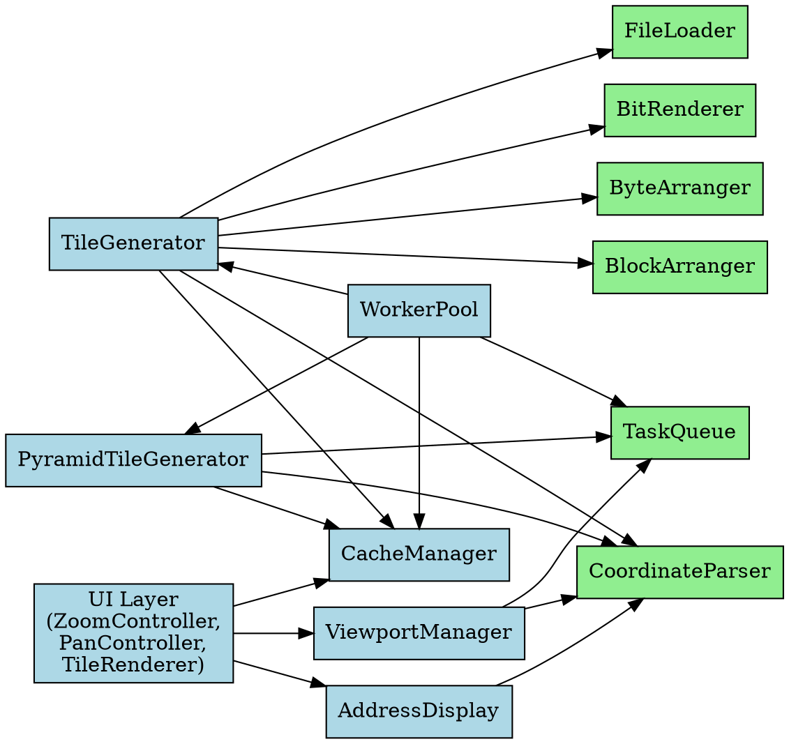

# Design Document: NAND Flash Viewer

## Overview

The NAND Flash Viewer is a high-performance visualization system for extremely large NAND flash dump files (50-500 GB). The design uses an image pyramid algorithm to enable immediate startup and responsive zoom/pan operations without preprocessing. The system generates tiles on-demand, caches them hierarchically, and distributes work across CPU cores using a priority-based task queue.

### Key Design Principles

1. **Immediate Startup**: No file scanning or preprocessing; metadata detected on-demand
2. **Lazy Evaluation**: Tiles generated only when needed for viewport
3. **Hierarchical Caching**: Multi-level pyramid reduces computation for zoom-out operations
4. **Priority-Based Work Distribution**: Viewport-aware task prioritization ensures responsive UI
5. **Bounded Memory**: Viewport-based loading prevents unbounded memory growth

## Architecture

### High-Level System Components

```
┌─────────────────────────────────────────────────────────────┐
│                        UI Layer                              │
│  (Viewport Manager, Zoom/Pan Controllers, Tile Renderer)    │
└────────────────────┬────────────────────────────────────────┘
                     │
┌────────────────────▼────────────────────────────────────────┐
│                   Tile Request Dispatcher                    │
│  (Routes requests to cache or generation pipeline)          │
└────────────────────┬────────────────────────────────────────┘
                     │
        ┌────────────┴────────────┐
        │                         │
┌───────▼──────────┐    ┌────────▼──────────┐
│  Cache Manager   │    │  Task Queue       │
│  (Hierarchical   │    │  (Priority-based) │
│   directory)     │    └────────┬──────────┘
└──────────────────┘             │
                        ┌────────▼──────────┐
                        │  Worker Pool      │
                        │  (CPU cores)      │
                        └────────┬──────────┘
                                 │
        ┌────────────┬───────────┴───────────┬────────────┐
        │            │                       │            │
┌───────▼──┐  ┌──────▼──────┐  ┌────────────▼──┐  ┌──────▼──┐
│ Tile Gen │  │ Pyramid Gen │  │ Coordinate    │  │ File    │
│ (L0)     │  │ (L1+)       │  │ Parser        │  │ Loader  │
└──────────┘  └─────────────┘  └───────────────┘  └─────────┘
```

### Component Dependency Graph

```
FileLoader
  ↑
  │ (reads from)
  │
TileGenerator ──→ BitRenderer
  ↑                ByteArranger
  │                BlockArranger
  │                CoordinateParser
  │
  ├─→ CacheManager (caches result)
  │
**Cache Manager**: Hierarchical directory structure (.cache/{dump_filename}/{level}/{block_y}/{block_x}.png)
  ↑                      TaskQueue (requests missing tiles)
  │
  ├─→ CoordinateParser (calculates child tile coords)
  │
WorkerPool ──→ TileGenerator
  ↑            PyramidTileGenerator
  │            CacheManager
  │            TaskQueue
  │
TaskQueue ──→ (no dependencies, pure data structure)
  ↑
  │ (enqueues tasks)
  │
ViewportManager ──→ CoordinateParser (calculates visible tiles)
  ↑
  │ (updates priorities)
  │
  └─→ TaskQueue
  
AddressDisplay ──→ CoordinateParser (converts mouse pos to address)
  ↑
  │ (displays)
  │
UI Layer ──→ ViewportManager
             ZoomController
             PanController
             AddressDisplay
             CacheManager (loads tiles for display)
```

### Detailed Dependencies

**FileLoader**
- No dependencies
- Used by: TileGenerator

**BitRenderer**
- No dependencies
- Used by: TileGenerator

**ByteArranger**
- No dependencies
- Used by: TileGenerator

**BlockArranger**
- No dependencies
- Used by: TileGenerator

**CoordinateParser**
- No dependencies
- Used by: TileGenerator, PyramidTileGenerator, ViewportManager, AddressDisplay

**TileGenerator**
- Depends on: FileLoader, BitRenderer, ByteArranger, BlockArranger, CoordinateParser, CacheManager
- Used by: WorkerPool

**PyramidTileGenerator**
- Depends on: CacheManager, TaskQueue, CoordinateParser
- Used by: WorkerPool

**CacheManager**
- No dependencies
- Used by: TileGenerator, PyramidTileGenerator, WorkerPool, UI Layer

**TaskQueue**
- No dependencies
- Used by: WorkerPool, PyramidTileGenerator, ViewportManager

**WorkerPool**
- Depends on: TaskQueue, TileGenerator, PyramidTileGenerator, CacheManager
- Used by: System initialization

**ViewportManager**
- Depends on: CoordinateParser, TaskQueue
- Used by: UI Layer, ZoomController, PanController

**AddressDisplay**
- Depends on: CoordinateParser
- Used by: UI Layer

**UI Layer Components** (ZoomController, PanController, TileRenderer)
- Depend on: ViewportManager, CacheManager, AddressDisplay
- Used by: User interaction

**File Loader**: Opens dump files, detects metadata (page length, block size), provides sequential byte access

**Tile Generator (Level 0)**: Converts tile coordinates to byte fragments, renders bits/bytes/blocks into PNG

**Pyramid Tile Generator**: Composes lower-level tiles, downscales to half resolution, caches result

**Task Queue**: Maintains high/normal/low priority queues, supports concurrent worker access

**Worker Pool**: One worker per CPU core, continuously processes queue in priority order

**Viewport Manager**: Identifies visible tiles, assigns priorities based on viewport position

**Cache Manager**: Hierarchical directory structure (.cache/{dump_file}{level}/{block_y}/{block_x}.png)

**Coordinate Parser**: Bidirectional conversion between tile coordinates and byte offsets


## Data Models

### File Metadata

```
FileMetadata {
  path: string
  size: u64 (bytes)
  pageLength: u32 (bytes per page)
  blockSize: u32 (pages per block)
  totalPages: u64
  totalBlocks: u64
  gridWidth: u32 (blocks per row in 4:3 grid)
  gridHeight: u32 (rows of blocks)
}
```

### Tile Coordinates

```
TileCoord {
  level: u32 (0 = highest resolution)
  x: u32 (tile column)
  y: u32 (tile row)
}
```

### Pyramid Level

```
PyramidLevel {
  level: u32
  tileWidth: u32 (pixels)
  tileHeight: u32 (pixels)
  tilesWide: u32
  tilesTall: u32
  totalTiles: u64
}
```

### Task Queue Entry

```
TileTask {
  coord: TileCoord
  priority: Priority (High | Normal | Low)
  retryCount: u32
  createdAt: Timestamp
}
```

### Viewport State

```
Viewport {
  level: u32 (current zoom level)
  centerX: f64 (pixels in level coordinate space)
  centerY: f64
  widthPixels: u32 (screen width)
  heightPixels: u32 (screen height)
  visibleTiles: Vec<TileCoord>
  adjacentTiles: Vec<TileCoord>
}
```

### Fragment (Byte Range)

```
Fragment {
  startByte: u64
  endByte: u64 (exclusive)
  length: u64
}
```

## Algorithms

### Coordinate Conversion: Tile → Byte Offset
### Coordinate Conversion: Tile → Byte Offset

Given tile coordinate (level, x, y) at resolution level:

1. Calculate tile dimensions at level 0: `tileW0 = tileWidth * 2^level`, `tileH0 = tileHeight * 2^level`
2. Calculate pixel position in level 0: `pixelX = x * tileW0`, `pixelY = y * tileH0`
3. Convert pixels to bits: `bitX = pixelX`, `bitY = pixelY`
4. Convert bits to bytes: `byteX = bitX / 8`, `byteY = bitY`
5. Account for page spacing: `pageSpacing` pixels between pages vertically
   - `pageHeight = pageLength * 8 + pageSpacing` (pixels per page including spacing)
   - `pageIndex = byteY / pageHeight`
   - `byteInPage = byteY % pageHeight`
### Coordinate Conversion: Byte Offset → Tile

Reverse of above:

1. Calculate block coordinates: `blockY = offset / (blockSize * pageLength * gridWidth)`, `blockX = (offset % (blockSize * pageLength * gridWidth)) / (blockSize * pageLength)`
2. Calculate byte position within block: `offsetInBlock = offset % (blockSize * pageLength)`
3. Calculate page and byte within page: `pageInBlock = offsetInBlock / pageLength`, `byteInPage = offsetInBlock % pageLength`
4. Calculate pixel position accounting for page spacing:
   - `pageSpacing` pixels between pages vertically
   - `pageHeight = pageLength * 8 + pageSpacing` (pixels per page including spacing)
   - `pixelX = (blockX * gridWidth + byteInPage) * 8`
   - `pixelY = (blockY * blockSize + pageInBlock) * pageHeight`
5. Calculate tile coordinates: `x = pixelX / (tileWidth * 2^level)`, `y = pixelY / (tileHeight * 2^level)`t % (blockSize * pageLength * gridWidth)) / (blockSize * pageLength)`
2. Calculate byte position within block: `offsetInBlock = offset % (blockSize * pageLength)`
3. Calculate page and byte within page: `pageInBlock = offsetInBlock / pageLength`, `byteInPage = offsetInBlock % pageLength`
4. Calculate pixel position: `pixelX = (blockX * gridWidth + byteInPage) * 8`, `pixelY = blockY * pageLength + pageInBlock`
5. Calculate tile coordinates: `x = pixelX / (tileWidth * 2^level)`, `y = pixelY / (tileHeight * 2^level)`

### Grid Layout Calculation (4:3 Aspect Ratio)

Given total blocks and target 4:3 ratio:

1. Calculate total pixels needed: `totalPixels = totalBlocks * pageLength * blockSize * 8`
2. Calculate aspect ratio: `width / height = 4 / 3`
3. Solve: `width * height = totalPixels` and `width = 4h / 3`
4. Result: `height = sqrt(3 * totalPixels / 4)`, `width = sqrt(4 * totalPixels / 3)`
5. Convert to blocks: `gridHeight = ceil(height / (pageLength * blockSize))`, `gridWidth = ceil(width / (pageLength * blockSize))`

### Fragment Calculation for Tile Generation

Given tile coordinate (level, x, y):

1. Calculate tile bounds in level 0 coordinates (see Coordinate Conversion)
2. Determine which pages and bytes are needed
3. Calculate contiguous byte ranges (fragments) from dump file
4. Return list of fragments to load

### Pyramid Tile Composition

Given pyramid tile at level L > 0:

1. Identify 4 child tiles at level L-1: (2x, 2y), (2x+1, 2y), (2x, 2y+1), (2x+1, 2y+1)
2. Load or request each child tile (high priority if missing)
3. Composite 4 tiles into 2x2 grid
4. Downscale result to half resolution (2:1 pixel averaging)
5. Cache result

### Priority Assignment Algorithm

Given viewport and tile coordinate:

```
if tile in viewport:
  priority = High
else if tile adjacent to viewport (within 1 tile distance):
  priority = Normal
else:
  priority = Low
```

### Exponential Backoff Retry

```
retryDelay = baseDelay * (backoffFactor ^ retryCount)
maxRetries = 3
if retryCount >= maxRetries:
  displayPlaceholder()
else:
  scheduleRetry(retryDelay)
```


## Components and Interfaces

### BitRenderer

Converts individual bits to pixels.

```
interface BitRenderer {
  renderBit(bit: 0 | 1) -> Pixel
  // bit 1 -> black pixel (0x000000)
  // bit 0 -> white pixel (0xFFFFFF)
  
  renderByte(byte: u8, startX: u32, canvas: PixelBuffer) -> void
  // Renders 8 bits horizontally, MSB on left, LSB on right
  // Each bit is one pixel
}
```

### ByteArranger

Arranges bytes horizontally within a page with no spacing between bytes.

```
interface ByteArranger {
  calculatePageWidth(pageLength: u32) -> u32
  // Returns pageLength * 8 (pixels, no spacing between bytes)
  
  renderPage(pageData: &[u8], canvas: PixelBuffer) -> void
  // Renders bytes left-to-right with no spacing
  // First byte at x=0, last byte at x=(pageLength-1)*8
}
```

### BlockArranger

Arranges pages vertically and blocks in grid layout.

```
interface BlockArranger {
  calculateBlockHeight(blockSize: u32, pageLength: u32) -> u32
  // Returns blockSize * pageLength * 8 + (blockSize-1) * pageSpacing
  
  calculateGridDimensions(totalBlocks: u64) -> (gridWidth: u32, gridHeight: u32)
  // Maintains 4:3 aspect ratio
  
  renderBlock(blockData: &[u8], blockX: u32, blockY: u32, canvas: PixelBuffer) -> void
  // Renders block at grid position with page spacing and block spacing
  
  getPageSpacing() -> u32
  getBlockSpacing() -> u32
  // blockSpacing > pageSpacing
}
```

### TileGenerator

Generates high-resolution tiles from dump fragments.

```
interface TileGenerator {
  generateTile(coord: TileCoord, metadata: FileMetadata, fileLoader: FileLoader) -> Result<PNG, Error>
  // 1. Calculate fragments needed
  // 2. Load fragments from file
  // 3. Render using BitRenderer, ByteArranger, BlockArranger
  // 4. Return PNG bytes
  
  calculateFragments(coord: TileCoord, metadata: FileMetadata) -> Vec<Fragment>
  // Returns byte ranges needed from dump file
}
```

### PyramidTileGenerator

Generates lower-resolution tiles from higher-resolution tiles.

```
interface PyramidTileGenerator {
  generatePyramidTile(coord: TileCoord, level: u32, taskQueue: TaskQueue, cache: CacheManager) -> Result<PNG, Error>
  // 1. Identify 4 child tiles at level-1
  // 2. Load or request children (high priority if missing)
  // 3. Composite into 2x2 grid
  // 4. Downscale to half resolution
  getTilePath(coord: TileCoord) -> Path
  // Returns .cache/{dump_filename}/{level}/{block_y}/{block_x}.png
  compositeTiles(tiles: [PNG; 4]) -> PNG
  // Combines 4 tiles into 2x2 grid
  
  downscale(tile: PNG, factor: 2) -> PNG
  // 2:1 pixel averaging
}
```

### TaskQueue

Priority-based queue for tile generation tasks.

```
interface TaskQueue {
  enqueue(task: TileTask) -> void
  // Thread-safe insertion
  
  dequeue() -> Option<TileTask>
  // Returns highest priority task, thread-safe
  
  updatePriority(coord: TileCoord, newPriority: Priority) -> void
  // Updates priority of existing task
  
  remove(coord: TileCoord) -> void
  // Removes task from queue
  
  size() -> usize
  // Returns total tasks in queue
}
```

### WorkerPool

Manages worker threads for parallel tile generation.

```
interface WorkerPool {
  new(numWorkers: usize, taskQueue: TaskQueue, cache: CacheManager) -> WorkerPool
  // Creates one worker per CPU core
  
  start() -> void
  // Spawns all worker threads
  
  shutdown() -> void
  // Gracefully stops all workers
  
  isRunning() -> bool
}

// Each worker:
// 1. Dequeues task from queue
// 2. Generates tile (high-res or pyramid)
// 3. Caches result
// 4. Marks task complete
// 5. Enters wait state if queue empty
```

### ViewportManager

Manages viewport state and tile prioritization.

```
interface ViewportManager {
  updateViewport(level: u32, centerX: f64, centerY: f64, widthPx: u32, heightPx: u32) -> void
  // Updates viewport and recalculates visible/adjacent tiles
  
  getVisibleTiles() -> Vec<TileCoord>
  // Returns tiles currently in viewport
  
  getAdjacentTiles() -> Vec<TileCoord>
  // Returns tiles adjacent to viewport (predictive loading)
  
  updateTaskPriorities(taskQueue: TaskQueue) -> void
  // Assigns high priority to visible, normal to adjacent, low to others
}
```

### AddressDisplay

Displays block/page/byte/bit address at mouse position.

```
interface AddressDisplay {
  updateMousePosition(screenX: u32, screenY: u32, viewport: Viewport, metadata: FileMetadata) -> void
  // Updates address based on mouse position
  
  getAddress() -> String
  // Returns formatted address "Block: X, Page: Y, Byte: Z, Bit: W" or "N/A"
  
  isMouseInBounds() -> bool
  // Returns true if mouse is over visualization
}
```

### CacheManager

Manages hierarchical cache directory structure.

```
interface CacheManager {
  new(cacheDir: Path) -> CacheManager
  // Creates .cache directory if needed
  
  getTilePath(coord: TileCoord) -> Path
  // Returns .cache/{level}/{block_y}/{block_x}.png
  
  tileExists(coord: TileCoord) -> bool
  // Checks if tile is cached
  
  loadTile(coord: TileCoord) -> Result<PNG, Error>
  // Loads PNG from cache
  
  saveTile(coord: TileCoord, png: PNG) -> Result<(), Error>
  // Saves PNG to cache with directory creation
  
  invalidateCache() -> void
  // Removes all cached tiles
}
```

### CoordinateParser

Bidirectional coordinate conversion.

```
interface CoordinateParser {
  tileToByteOffset(coord: TileCoord, metadata: FileMetadata) -> u64
  // Converts tile coordinates to byte offset in dump
  
  byteOffsetToTile(offset: u64, level: u32, metadata: FileMetadata) -> TileCoord
  // Converts byte offset to tile coordinates
  
  prettyPrint(coord: TileCoord) -> String
  // Returns "L{level}:({x},{y})" format
}
```

### FileLoader

Provides sequential access to dump file.

```
interface FileLoader {
  new(path: Path) -> Result<FileLoader, Error>
  // Opens file, detects metadata
  
  getMetadata() -> FileMetadata
  // Returns cached metadata
  
  readBytes(offset: u64, length: u32) -> Result<Vec<u8>, Error>
  // Reads bytes from dump file
  
  readFragments(fragments: Vec<Fragment>) -> Result<Vec<u8>, Error>
  // Reads multiple fragments, concatenates
}
```


## Correctness Properties

*A property is a characteristic or behavior that should hold true across all valid executions of a system—essentially, a formal statement about what the system should do. Properties serve as the bridge between human-readable specifications and machine-verifiable correctness guarantees.*

### Property 1: File Size Acceptance

For any NAND dump file with size between 50 GB and 500 GB, the viewer SHALL accept the file without rejection.

**Validates: Requirements 1.1**

### Property 2: Immediate Startup Without Preprocessing

For any NAND dump file, the time from file open to initial viewport display SHALL be less than 500ms, and the viewer SHALL NOT scan the entire file or precompute tiles.

**Validates: Requirements 1.2, 17.1, 17.2, 17.3**

### Property 3: User-Provided Page Length

For any page length provided by the user within the valid range (500-20000 bytes), the viewer SHALL accept and store it in file metadata.

**Validates: Requirements 1.2, 15.1, 15.5**

### Property 4: User-Provided Block Size

For any block size provided by the user (64, 128, 256, 512, or 1024 pages per block), the viewer SHALL accept and store it in file metadata.

**Validates: Requirements 1.3, 15.2, 15.6**

### Property 5: Parameter Validation

For any invalid page length or block size provided by the user, the viewer SHALL display an error message and request valid values.

**Validates: Requirements 15.3, 15.4**

### Property 6: Metadata Storage

For any NAND dump file with user-provided page length and block size, the viewer SHALL store file metadata (size, page length, block size) in memory and make it available for tile generation.

**Validates: Requirements 1.6**

### Property 7: Bit-to-Pixel Rendering

For any byte value, the bit renderer SHALL produce exactly 8 pixels (one per bit), with bit value 1 rendered as black and bit value 0 as white, in LSB-first order (MSB on left, LSB on right).

**Validates: Requirements 2.1, 2.2, 2.3, 2.4, 2.5**

### Property 8: Byte Horizontal Arrangement

For any page data, the byte arranger SHALL display bytes horizontally in sequence from left to right, with the first byte on the left and the last byte on the right, with no spacing between bytes.

**Validates: Requirements 3.1, 3.2, 3.3, 3.4**

### Property 9: Page Vertical Arrangement

For any block data, the block arranger SHALL display pages vertically in sequence from top to bottom, with the first page at the top and the last page at the bottom, maintaining consistent page spacing.

**Validates: Requirements 4.1, 4.2, 4.3, 4.4**

### Property 10: Block Spacing Hierarchy

For any rendered block layout, the spacing between consecutive blocks SHALL be larger than the spacing between consecutive pages.

**Validates: Requirements 4.5**

### Property 11: Grid Layout Arrangement

For any set of blocks, the block arranger SHALL arrange them in a grid layout (top-to-bottom, left-to-right) and maintain an aspect ratio of approximately 4:3 (width:height).

**Validates: Requirements 4.6, 4.7**

### Property 12: Pyramid Level Organization

For any NAND dump file, the pyramid SHALL organize tiles into multiple resolution levels, with level 0 as the highest resolution and each subsequent level having half the dimensions of the previous level.

**Validates: Requirements 5.1, 5.2, 5.3**

### Property 13: Pyramid Termination

For any NAND dump file, the pyramid SHALL continue creating levels until the entire dump fits in a single tile.

**Validates: Requirements 5.4**

### Property 14: Pyramid Composition Strategy

For any pyramid tile at resolution level L > 0, the pyramid generator SHALL generate it by compositing tiles from level L-1 (not by reading directly from the dump).

**Validates: Requirements 5.5**

### Property 15: Consistent Tile Dimensions

For all tiles in the pyramid, the tile dimensions SHALL be consistent across all resolution levels.

**Validates: Requirements 5.6**

### Property 16: Fragment Calculation

For any high-resolution tile request, the tile generator SHALL calculate the correct byte ranges (fragments) from the dump file needed to render that tile.

**Validates: Requirements 6.1, 6.2**

### Property 17: Tile Rendering

For any high-resolution tile, the tile generator SHALL render fragments into a PNG tile using the bit/byte/block arrangement rules.

**Validates: Requirements 6.3**

### Property 17: Tile Caching

For any generated tile, the tile generator SHALL cache the PNG in the ".cache" directory with the hierarchical structure ".cache/{level}/{block_y}/{block_x}.png".

**Validates: Requirements 6.4, 8.1, 8.2**

### Property 18: Cache Lookup

For any tile request, the cache manager SHALL check if the tile exists in the cache before generating, and if it exists, SHALL load it instead of regenerating.

**Validates: Requirements 8.3, 8.4**

### Property 19: Pyramid Tile Generation

For any pyramid tile request, the pyramid tile generator SHALL load tiles from the resolution level below and composite them into a single tile, then downscale to half resolution.

**Validates: Requirements 7.1, 7.3, 7.4, 7.5**

### Property 20: Missing Tile Priority

For any pyramid tile generation where a required lower-level tile is not cached, the pyramid tile generator SHALL send a high-priority request to the task queue for that tile.

**Validates: Requirements 7.2**

### Property 21: Task Queue Priority Levels

For any task queue, it SHALL maintain three distinct priority levels (high, normal, low) and process tasks in priority order (high first, then normal, then low).

**Validates: Requirements 9.1, 9.6**

### Property 22: Viewport Tile Prioritization

For any tile entering the viewport, the task queue SHALL assign it high priority, and when it exits the viewport, SHALL allow its high-priority status to be withdrawn.

**Validates: Requirements 9.2, 9.3**

### Property 23: Adjacent Tile Prioritization

For any tile outside the viewport but adjacent to it, the task queue SHALL assign it normal priority. For any tile far from the viewport, SHALL assign it low priority.

**Validates: Requirements 9.4, 9.5**

### Property 24: Thread-Safe Queue Access

For any task queue with concurrent access from multiple workers, the queue SHALL maintain data integrity without corruption.

**Validates: Requirements 9.7**

### Property 25: Worker Pool Creation

For any system, the worker pool SHALL create exactly one worker per available CPU core.

**Validates: Requirements 10.1, 10.2**

### Property 26: Worker Priority Processing

For any worker, it SHALL continuously check the task queue and process tiles in priority order (high → normal → low).

**Validates: Requirements 10.3, 10.4**

### Property 27: Worker Task Completion

For any completed tile, the worker SHALL cache it and mark the task as complete.

**Validates: Requirements 10.5**

### Property 28: Worker Idle State

For any worker when the task queue is empty, the worker SHALL enter a low-power wait state.

**Validates: Requirements 10.6**

### Property 29: Viewport Tile Identification

For any viewport change, the viewport manager SHALL identify which tiles are now visible and assign high priority to all visible tiles.

**Validates: Requirements 11.1, 11.2**

### Property 30: Predictive Tile Loading

For any viewport, the viewport manager SHALL assign normal priority to tiles adjacent to the viewport for predictive loading.

**Validates: Requirements 11.3**

### Property 31: Real-Time Priority Updates

For any pan or zoom operation, the viewport manager SHALL update tile priorities in real-time as the viewport changes.

**Validates: Requirements 11.4, 11.5**

### Property 32: Zoom In Resolution

For any zoom-in operation, the zoom controller SHALL increase the zoom level (more pixels per bit).

**Validates: Requirements 12.1**

### Property 33: Zoom Out Resolution

For any zoom-out operation, the zoom controller SHALL decrease the zoom level (fewer pixels per bit).
### Property 49: Cache Directory Creation

For any cache manager, it SHALL create the ".cache" directory if it does not exist and organize tiles in subdirectories by dump filename, resolution level, and block coordinates.

**Validates: Requirements 19.1, 19.2, 19.3, 19.4**
For any zoom operation, the zoom controller SHALL maintain the center point of the viewport.

**Validates: Requirements 12.3**

### Property 35: Continuous Zoom Support

For any zoom level, the zoom controller SHALL support continuous zoom levels (not just discrete steps).

**Validates: Requirements 12.4**

### Property 36: Zoom Tile Requests

For any new zoom level reached, the zoom controller SHALL request tiles for the new viewport.
### Property 52: Cache Isolation

For any multiple dump files, each dump file SHALL have its own cache directory (".cache/{dump_filename}/") and worker pool.

**Validates: Requirements 20.2, 20.3**
For any dump file opened, the default zoom level SHALL be 1 bit equals 1 pixel.

**Validates: Requirements 12.6**

### Property 38: Maximum Zoom Level

For any zoom operation, the maximum zoom level SHALL be 1 bit equals 16x16 pixels (256 pixels per bit).

**Validates: Requirements 12.7**

### Property 39: Minimum Zoom Level

For any dump file, the minimum zoom level SHALL be such that the entire dump visualization fits in a quarter of the screen.

**Validates: Requirements 12.8**

### Property 40: Pan Viewport Update

For any pan operation, the pan controller SHALL update the viewport coordinates and request tiles for the new viewport region.

**Validates: Requirements 13.1, 13.2**

### Property 38: Pan Boundary Enforcement

For any pan operation reaching the edge of the dump, the pan controller SHALL prevent further panning beyond bounds.

**Validates: Requirements 13.4**

### Property 40: Pan Viewport Update

For any pan operation, the pan controller SHALL update the viewport coordinates and request tiles for the new viewport region.

**Validates: Requirements 13.1, 13.2**

### Property 41: Initial Viewport Position

For any dump file opened, the viewer SHALL position the viewport at the upper left corner (first page, first byte) and start at the default zoom level (1 bit = 1 pixel).

**Validates: Requirements 14.1, 14.2, 12.6**

### Property 42: Initial Tile Requests

For any dump file opened, the viewer SHALL immediately request tiles for the initial viewport.

**Validates: Requirements 14.3, 14.4**

### Property 43: Tile Generation Error Handling

For any tile generation failure, the error handler SHALL log the error with context (tile coordinates, reason) and retry with exponential backoff.

**Validates: Requirements 16.1, 16.2**

### Property 44: Tile Failure Isolation

For any tile generation failure, the error handler SHALL NOT block other tile generation tasks.

**Validates: Requirements 16.4**

### Property 45: Placeholder Tile Display

For any tile that fails after maximum retries, the error handler SHALL display a placeholder tile indicating the error.

**Validates: Requirements 16.3**

### Property 46: Coordinate Round-Trip

For any valid tile coordinate, converting to byte offset and back SHALL produce an equivalent coordinate.

**Validates: Requirements 18.4**

### Property 47: Coordinate Conversion Accuracy

For any tile coordinate, the coordinate parser SHALL convert to byte offset accounting for page length, block size, and grid layout.

**Validates: Requirements 18.1, 18.2, 18.3**

### Property 48: Coordinate Pretty-Printing

For any tile coordinate, the pretty printer SHALL format it as a human-readable string for logging and debugging.

**Validates: Requirements 18.5**

### Property 49: Cache Directory Creation

For any cache manager, it SHALL create the ".cache" directory if it does not exist and organize tiles in subdirectories by resolution level and block coordinates.

**Validates: Requirements 19.1, 19.2, 19.3, 19.4**

### Property 50: Cache Cleanup

For any cache manager, it SHALL support cache cleanup to remove old or unused tiles.

**Validates: Requirements 19.5**

### Property 51: Multi-File Support

For any multiple dump files opened, the viewer SHALL support them in separate windows or tabs with independent state.

**Validates: Requirements 20.1**

### Property 52: Cache Isolation

For any multiple dump files, each dump file SHALL have its own cache directory (".cache/{dump_id}/") and worker pool.

**Validates: Requirements 20.2, 20.3**

### Property 53: State Preservation

For any switch between multiple dump files, the viewer SHALL preserve the viewport position and zoom level for each dump.

**Validates: Requirements 20.4**

### Property 54: Mouse Position Address Calculation

For any mouse position over the visualization, the address display SHALL calculate the correct block, page, byte, and bit address at that position.

**Validates: Requirements 21.1, 21.5**

### Property 55: Continuous Address Update

For any mouse movement over the visualization, the address display SHALL continuously update the displayed address.

**Validates: Requirements 21.2**

### Property 56: Address Format

For any valid mouse position, the address display SHALL format the address as "Block: X, Page: Y, Byte: Z, Bit: W".

**Validates: Requirements 21.3**

### Property 57: Out-of-Bounds Address Display

For any mouse position outside the visualization bounds, the address display SHALL display "N/A" or hide the address.

**Validates: Requirements 21.4**

### Property 58: Address Display Visibility

For any dump file, the address display SHALL be visible in the UI at all times (e.g., in a status bar or tooltip).

**Validates: Requirements 21.6**


## Error Handling

### File I/O Errors

**Scenario**: File cannot be read or is corrupted

**Handling**:
1. Catch I/O error during file open
2. Log error with specific details (permission denied, file not found, etc.)
3. Display user-friendly error message with technical details
4. Prevent viewer from proceeding

**Recovery**: User must select a different file

### Tile Generation Failures

**Scenario**: Fragment cannot be read from dump or rendering fails

**Handling**:
1. Catch error during tile generation
2. Log error with tile coordinates and reason
3. Increment retry count
4. Schedule retry with exponential backoff: `delay = baseDelay * (2 ^ retryCount)`
5. After 3 retries, display placeholder tile with error indicator
6. Continue processing other tiles (non-blocking)

**Recovery**: Placeholder tile indicates error; user can retry or continue

### Metadata Detection Failures

**Scenario**: Page length or block size cannot be inferred

**Handling**:
1. Attempt to detect from first block
2. If ambiguous, apply heuristics based on file size and common NAND configurations
3. If still ambiguous, use conservative defaults (smallest page length, smallest block size)
4. Log warning with detected values
5. Allow user to override if needed

**Recovery**: Viewer proceeds with detected/default values

### Cache Corruption

**Scenario**: Cached tile file is corrupted or incomplete

**Handling**:
1. Detect corruption during cache load (PNG validation fails)
2. Delete corrupted file
3. Regenerate tile
4. Log warning

**Recovery**: Tile is regenerated and cached again

### Worker Thread Crashes

**Scenario**: Worker thread encounters unhandled exception

**Handling**:
1. Catch exception in worker thread
2. Log error with stack trace
3. Restart worker thread
4. Return task to queue for retry

**Recovery**: Worker restarts and continues processing

## Testing Strategy

### Unit Testing Approach

Unit tests verify specific examples, edge cases, and error conditions:

- **Bit rendering**: Verify 1→black, 0→white, LSB-first ordering
- **Byte arrangement**: Verify first byte left, last byte right
- **Block arrangement**: Verify page/block spacing, grid layout
- **Coordinate conversion**: Verify round-trip accuracy with various page/block sizes
- **Fragment calculation**: Verify correct byte ranges for tile coordinates
- **Cache operations**: Verify directory creation, file I/O, cache hits/misses
- **Priority assignment**: Verify viewport/adjacent/distant tile prioritization
- **Error handling**: Verify retry logic, placeholder display, non-blocking behavior

### Property-Based Testing Approach

Property-based tests verify universal properties across all inputs using randomization:

**Testing Library**: Use language-appropriate PBT library (QuickCheck for Haskell, Hypothesis for Python, fast-check for JavaScript, proptest for Rust, etc.)

**Configuration**: Minimum 100 iterations per property test

**Property Test Examples**:

1. **Coordinate Round-Trip** (Property 44)
   - Generate random tile coordinates
   - Convert to byte offset and back
   - Verify result equals original
   - Tag: `Feature: nand-flash-viewer, Property 44: Coordinate round-trip`

2. **Pyramid Level Scaling** (Property 11)
   - Generate random pyramid levels
   - Verify each level has half dimensions of previous
   - Verify all levels have consistent tile dimensions
   - Tag: `Feature: nand-flash-viewer, Property 11: Pyramid level organization`

3. **Priority Ordering** (Property 21)
   - Generate random tiles with mixed priorities
   - Enqueue in random order
   - Dequeue all tiles
   - Verify dequeue order respects priority (high → normal → low)
   - Tag: `Feature: nand-flash-viewer, Property 21: Task queue priority levels`

4. **Cache Consistency** (Property 18)
   - Generate random tiles
   - Save to cache
   - Load from cache
   - Verify loaded tile equals saved tile
   - Tag: `Feature: nand-flash-viewer, Property 18: Cache lookup`

5. **Viewport Tile Identification** (Property 29)
   - Generate random viewport positions and sizes
   - Calculate visible tiles
   - Verify all visible tiles are within viewport bounds
   - Verify no tiles outside viewport are marked visible
   - Tag: `Feature: nand-flash-viewer, Property 29: Viewport tile identification`

6. **Fragment Calculation** (Property 15)
   - Generate random tile coordinates
   - Calculate fragments
   - Verify fragments cover entire tile area
   - Verify fragments don't overlap
   - Verify fragments are contiguous
   - Tag: `Feature: nand-flash-viewer, Property 15: Fragment calculation`

7. **Grid Layout Aspect Ratio** (Property 10)
   - Generate random block counts
   - Calculate grid dimensions
   - Verify aspect ratio is approximately 4:3
   - Verify all blocks fit in grid
   - Tag: `Feature: nand-flash-viewer, Property 10: Grid layout arrangement`

8. **Worker Pool Concurrency** (Property 24)
   - Generate random tasks
   - Spawn multiple workers
   - Enqueue tasks concurrently
   - Verify no data corruption
   - Verify all tasks processed
   - Tag: `Feature: nand-flash-viewer, Property 24: Thread-safe queue access`

### Integration Testing

Integration tests verify component interactions:

- **File load → metadata detection → tile generation**: Verify end-to-end flow
- **Viewport change → priority update → tile generation**: Verify viewport-driven loading
- **Zoom/pan → viewport update → tile requests**: Verify UI interaction flow
- **Cache hit → tile display**: Verify cached tiles are used
- **Cache miss → generation → caching**: Verify new tiles are generated and cached
- **Multiple workers → concurrent generation**: Verify parallel processing

### Performance Testing

Performance tests verify non-functional requirements:

- **Startup time**: Verify initial display within 500ms
- **Tile generation throughput**: Verify tiles generated at reasonable rate
- **Memory usage**: Verify bounded memory with viewport-based loading
- **Cache efficiency**: Verify cache reduces regeneration

### Test Coverage Goals

- **Unit tests**: 80%+ code coverage
- **Property tests**: All testable acceptance criteria
- **Integration tests**: All major workflows
- **Performance tests**: All non-functional requirements


## Performance Considerations

### Immediate Startup (< 500ms)

**Challenge**: Opening a 500 GB file must be instant

**Solution**:
- No file scanning: Only read first block for metadata detection
- No preprocessing: Tiles generated on-demand
- Lazy initialization: Workers spawned but idle until needed
- Metadata caching: Store detected page/block sizes in memory

**Metrics**:
- File open to first display: < 500ms
- Metadata detection: < 100ms
- Initial tile requests: < 50ms

### Efficient Fragment Loading

**Challenge**: Minimize I/O for large files

**Solution**:
- Calculate exact byte ranges needed (fragments)
- Load only required fragments, not entire pages/blocks
- Batch fragment reads when possible
- Use memory-mapped I/O for large files (if supported)

**Metrics**:
- Fragment calculation: O(1) per tile
- I/O operations: Minimized to exact byte ranges
- Cache hit rate: Target 80%+ for repeated viewport regions

### Tile Caching Strategy

**Hierarchical Cache**:
- Level 0 (high-res): Cache all generated tiles
- Level 1+: Cache pyramid tiles (smaller, fewer)
- Directory structure: `.cache/{level}/{block_y}/{block_x}.png`

**Cache Eviction**:
- LRU (Least Recently Used) for memory-bounded systems
- Optional: Persistent cache on disk for repeated sessions

**Metrics**:
- Cache hit rate: 80%+ for typical workflows
- Cache size: Bounded by available disk space
- Cache lookup: O(1) directory access

### Worker Synchronization

**Challenge**: Coordinate multiple workers without contention

**Solution**:
- Lock-free queue (if possible) or fine-grained locking
- Each worker processes independent tiles
### System Requirements

- **CPU**: Single-core or multi-core processor (multi-core recommended for better performance)
- **RAM**: 512 MB minimum, 2+ GB recommended
- **Disk**: 10+ GB free for cache (configurable)
- **I/O**: SSD recommended for performance, HDD acceptable
- Throughput: Linear scaling with CPU cores (up to 8 cores)

### Memory-Bounded Viewport Loading

**Challenge**: Prevent unbounded memory growth with large files

**Solution**:
- Viewport-based loading: Only load visible + adjacent tiles
- Bounded tile cache: Limit to N tiles in memory
- Evict tiles outside viewport + margin
- Streaming rendering: Don't load entire level into memory

**Metrics**:
- Memory usage: Bounded to ~100MB for typical viewport
- Tile cache size: Max 50-100 tiles in memory
- Eviction rate: Proportional to pan speed

## Integration Points

### File System Access

**Operations**:
- Open dump file (read-only)
- Create/read cache directory structure
- Write PNG tiles to cache
- Delete cache files (cleanup)

**Considerations**:
- Handle permission errors gracefully
- Support network file systems (NFS, SMB)
- Optimize for SSD vs HDD performance

### UI Event Handling

**Events**:
- File selection (open dump)
- Zoom in/out (mouse wheel, keyboard)
- Pan (mouse drag, arrow keys)
- Viewport resize (window resize)

**Handling**:
- Debounce rapid events (zoom, pan)
- Update viewport asynchronously
- Request tiles without blocking UI
- Display loading indicators

### Worker Thread Management

**Lifecycle**:
- Create workers on startup
- Spawn one per CPU core
- Graceful shutdown on exit
- Handle worker crashes

**Communication**:
- Task queue: Workers pull tasks
- Cache: Workers write results
- Logging: Workers report progress/errors

## Design Decisions and Rationales

### Why Image Pyramid?

**Rationale**: Enables efficient zoom-out without regenerating from dump. Each level is half resolution, so zooming out 10 levels requires only 4 tiles instead of 1 million.

**Alternative**: Generate all tiles on-demand from dump. Problem: Zoom-out would require reading/processing massive amounts of data.

### Why Priority-Based Queue?

**Rationale**: Ensures viewport is always responsive. High-priority tiles (visible) are processed first, so user sees content immediately.

**Alternative**: FIFO queue. Problem: Distant tiles could block viewport tiles, causing lag.

### Why Viewport-Based Loading?

**Rationale**: Bounds memory usage. Only load tiles user can see + adjacent tiles for predictive loading.

**Alternative**: Load all tiles. Problem: 500 GB file would require 500 GB of memory.

### Why Hierarchical Cache?

**Rationale**: Organizes tiles logically by level and position. Easy to locate, clean up, or invalidate.

**Alternative**: Flat cache directory. Problem: Millions of files in one directory is slow.

### Why One Worker Per CPU Core?

**Rationale**: Maximizes parallelism without oversubscription. Each worker processes one tile at a time.

**Alternative**: Fixed number of workers. Problem: Underutilizes multi-core systems or causes contention.

### Why Exponential Backoff Retry?

**Rationale**: Handles transient I/O errors without overwhelming system. Gives system time to recover.

**Alternative**: Immediate retry. Problem: Could cause cascading failures or infinite loops.

## Deployment Considerations

### System Requirements

- **CPU**: Multi-core processor (2+ cores recommended)
- **RAM**: 512 MB minimum, 2+ GB recommended
- **Disk**: 10+ GB free for cache (configurable)
- **I/O**: SSD recommended for performance, HDD acceptable

### Configuration

- **Tile size**: 512x512 pixels (configurable)
- **Cache directory**: `.cache/` (configurable)
- **Worker count**: Auto-detect CPU cores (configurable)
- **Retry attempts**: 3 (configurable)
- **Backoff factor**: 2x (configurable)

### Monitoring

- **Metrics**: Tile generation rate, cache hit rate, memory usage
- **Logging**: Errors, warnings, debug info (configurable level)
- **Profiling**: CPU usage, I/O throughput, memory allocation

## Future Enhancements

1. **Incremental Cache**: Persist cache across sessions
2. **Compression**: Compress cached tiles to reduce disk usage
3. **Network Streaming**: Support remote dump files over HTTP/S
4. **Collaborative Viewing**: Share viewport with other users
5. **Annotation**: Mark regions of interest with notes
6. **Export**: Save viewport regions as images or data
7. **Comparison**: Side-by-side comparison of multiple dumps
8. **Analysis**: Statistical analysis of bit patterns, entropy, etc.


### Graphviz Dependency Diagram


